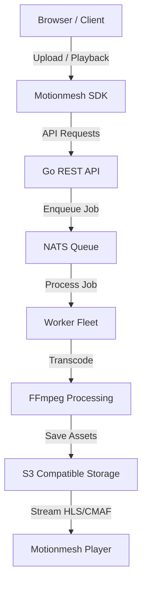
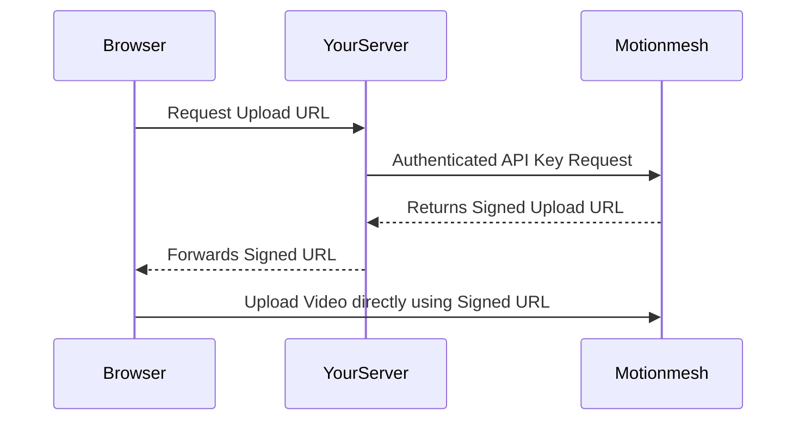

<div align="center">
  <!-- 1. Hero Section -->
  <picture>
    <source media="(prefers-color-scheme: dark)" srcset="https://res.cloudinary.com/df0nvtma5/image/upload/v1785687930/y4zanv58doxvubugnjcu.png">
    
  </picture>

  <h1 align="center">
    <font size="7" color="#008AFF">Motionmesh</font>
  </h1>

  <p><strong>Open-source video infrastructure for developers.</strong></p>

  <p>Upload, store, transcode, stream, and deliver video at scale. Build video platforms without the complexity.</p>

  <p>
    <a href="https://motionmesh.co.in/docs">Documentation</a> •
    <a href="https://motionmesh.co.in">Website</a> •
    <a href="https://dashboard.motionmesh.co.in">Dashboard</a> •
    <a href="https://motionmesh.co.in/docs/sdk">SDK</a> •
    <a href="https://discord.gg/motionmesh">Discord</a> •
    <a href="https://github.com/sanjeev0303/motionmesh/discussions">Discussions</a> •
    <a href="https://www.npmjs.com/package/@motionmesh/sdk">@motionmesh/sdk</a> •
    <a href="https://www.npmjs.com/package/@motionmesh/player">@motionmesh/player</a> •
    <a href="https://pypi.org/project/motionmesh/">PyPI</a>
  </p>

  <!-- 2. Badges -->
  <p>
    <a href="https://www.npmjs.com/package/@motionmesh/sdk"></a>
    <a href="https://pypi.org/project/motionmesh/"></a>
    <a href="https://github.com/sanjeev0303/motionmesh/actions"></a>
    <a href="LICENSE"></a>
    
    
    
    
    
    
    
    
    
  </p>
</div>

---

## 3. Hero Description

Motionmesh is a powerful, self-hosted video infrastructure platform designed specifically for developers. It provides everything you need to build scalable video applications—allowing you to upload, store, transcode, stream, and deliver high-quality video globally.

Built with performance and developer experience in mind, Motionmesh leverages Go for its high-performance backend, FFmpeg for robust media processing, and Cloudflare for edge delivery. Combined with S3-compatible storage and deep integration with Next.js, TypeScript, and Python, Motionmesh delivers an enterprise-grade video stack out of the box.

---

## 4. Architecture

Motionmesh is designed as a highly scalable modular monolith, ensuring that your video processing pipeline is robust and performant.



---

## 5. Why Motionmesh?

- **Developer Experience (DX):** Intuitive SDKs, comprehensive documentation, and a focus on type safety make integrating video into your app a breeze.
- **Scalability:** Built on Go and NATS, the architecture scales horizontally to handle massive workloads.
- **Cost Effective:** Bring your own S3 storage, avoiding the massive markups of traditional Video-as-a-Service providers.
- **Security by Design:** Motionmesh utilizes a proxy pattern to ensure your API keys are never exposed to the client.
- **Self-Hosting Freedom:** Full control over your infrastructure with production-ready Docker and Kubernetes configurations.
- **Cloud Support:** Seamlessly integrates with AWS, Backblaze, and more.

---

## 6. Features

| Category | Features |
|---|---|
| **Storage** | • S3-compatible Object Storage<br>• Dual-bucket support (upload/output)<br>• Bring-your-own storage |
| **Video** | • FFmpeg Transcoding<br>• Adaptive Bitrate (ABR) Ladder (1080p - 240p)<br>• HLS / CMAF Output<br>• Watermarking<br>• Thumbnail Generation<br>• Preview Clips<br>• Scrub Sprites |
| **AI** | • Automated Captions<br>• Transcript Generation<br>• Chapter Detection |
| **SDK** | • Type-safe JavaScript/TypeScript SDK<br>• Python SDK<br>• React Player Component |
| **Dashboard** | • Asset Management<br>• Analytics<br>• Billing<br>• User Management<br>• API Key Generation<br>• Log Viewing |
| **Auth** | • Strict Server-to-Server Proxy Pattern<br>• Signed URLs<br>• JWT Verification |
| **Infra** | • Go Backend<br>• Worker Fleet<br>• Terraform Configurations<br>• Kubernetes Ready |

---

## 7. Ecosystem

<div align="center">
  <table>
    <tr>
      <td align="center"><strong>JavaScript SDK</strong><br><a href="https://www.npmjs.com/package/@motionmesh/sdk">@motionmesh/sdk</a></td>
      <td align="center"><strong>Player SDK</strong><br><a href="https://www.npmjs.com/package/@motionmesh/player">@motionmesh/player</a></td>
      <td align="center"><strong>Python SDK</strong><br><a href="https://pypi.org/project/motionmesh/">motionmesh</a></td>
    </tr>
    <tr>
      <td align="center"><strong>REST API</strong><br>OpenAPI Spec</td>
      <td align="center"><strong>Dashboard</strong><br>Next.js Interface</td>
      <td align="center"><strong>CLI</strong><br><em>(Planned)</em></td>
    </tr>
    <tr>
      <td align="center"><strong>Terraform</strong><br>Infrastructure as Code</td>
      <td align="center"><strong>Docker</strong><br>Containerized Apps</td>
      <td align="center"><strong>Kubernetes</strong><br>Helm Charts</td>
    </tr>
  </table>
</div>

---

## 8. Installation

Install the Motionmesh SDKs using your preferred package manager:

```bash
# npm
npm install @motionmesh/sdk @motionmesh/player

# pnpm
pnpm add @motionmesh/sdk @motionmesh/player

# yarn
yarn add @motionmesh/sdk @motionmesh/player

# bun
bun add @motionmesh/sdk @motionmesh/player

# Python
pip install motionmesh
```

---

## 9. Quick Start

> [!IMPORTANT]
> The browser SDK should **never** hold your API key. Always use a server proxy.

### JavaScript / TypeScript

```typescript
import { MotionmeshClient } from "@motionmesh/sdk";

// Initialize the client on your server
const client = new MotionmeshClient({ apiKey: process.env.MOTIONMESH_API_KEY });

// Create a transcode job
const video = await client.mediaConverter.createJob({
  file: myVideoFile,
  bucketId: process.env.MOTIONMESH_BUCKET_ID,
});

// Retrieve a playback URL
const playbackUrl = await client.videos.getPlaybackUrl(video.id);
```

### Python

```python
from motionmesh import Client

# Initialize the client
client = Client(api_key="mot_live_...")

# Upload a video
video = client.videos.upload("input.mp4", bucket_id="...")

# Get playback URL
playback_url = client.videos.get_playback_url(video.id)
```

### React Player

```tsx
import { MotionmeshPlayer } from "@motionmesh/player";
import "@motionmesh/player/styles.css";

export default function VideoPage() {
  return (
    <div className="video-container">
      <MotionmeshPlayer src="https://api.yourdomain.com/v1/videos/vid_123/hls/master.m3u8" />
    </div>
  );
}
```

---

## 10. Complete Upload Flow

Motionmesh handles the entire video lifecycle, from ingestion to analytics.

`Upload` ➔ `Transcode` ➔ `Playback` ➔ `Player` ➔ `Analytics`

1. **Upload:** Securely upload source media directly to your S3 bucket.
2. **Transcode:** Our worker fleet spins up FFmpeg to generate HLS/CMAF ladders, AI captions, and thumbnails.
3. **Playback:** HLS streams are served directly from storage via secure URLs.
4. **Player:** The `@motionmesh/player` handles seamless Adaptive Bitrate (ABR) streaming.
5. **Analytics:** The player reports telemetry back to the dashboard.

---

## 11. Authentication

Motionmesh enforces a strict server-to-server security model via a proxy pattern.

> [!CAUTION]
> Exposing your `MOTIONMESH_API_KEY` to the client is a severe security vulnerability.

The browser-side SDK communicates with a trusted proxy route on your server, which then forwards the authenticated requests to the Motionmesh API. Playback is secured using short-lived Signed URLs via JWT.



---

## 12. SDK Examples

Our SDK simplifies complex video workflows.

- **Upload:** Direct-to-S3 multipart uploads.
- **Playback:** Generate secure HLS/CMAF streaming URLs.
- **Signed URLs:** Issue time-bound access tokens.
- **Media Conversion:** Trigger FFmpeg transcoding jobs.
- **Buckets:** Manage source and output storage configurations.
- **Authentication:** Proxy request handlers for Next.js/Express.
- **Errors:** Strongly typed error handling.
- **Streaming:** Real-time event webhooks for transcode progress.

---

## 13. Player

The `@motionmesh/player` is a drop-in React component built on top of Vidstack, providing a premium viewing experience out of the box.

- **ABR (Adaptive Bitrate):** Automatic resolution switching based on network conditions.
- **Vidstack Core:** Built on robust, accessible video primitives.
- **Captions & Subtitles:** Native support for VTT and multiple languages.
- **Quality Switching:** Manual override controls for viewers.
- **Picture in Picture (PiP):** Floating video support.
- **Fullscreen:** Native fullscreen API integration.
- **Keyboard Shortcuts:** Standard media controls (Space, Arrow keys, M, F).

---

## 14. Dashboard

Manage your entire video infrastructure from a beautiful, unified interface.

- **Media:** View, organize, and moderate all uploaded assets.
- **Buckets:** Configure your S3 credentials and routing.
- **Analytics:** Real-time metrics on bandwidth, storage, and engagement.
- **Billing:** Usage-based Stripe integration.
- **Users:** Manage your team and access controls.
- **Projects:** Isolate environments (Dev, Staging, Prod).
- **API Keys:** Roll and manage authentication tokens.
- **Logs:** Deep dive into worker and transcoding logs.

---

## 15. REST API

For total control, Motionmesh exposes a fully documented REST API.

- **OpenAPI:** Complete OpenAPI 3.0 specification available.
- **SDKs:** Generated clients for seamless integration.
- **Authentication:** Bearer token authentication.
- **Versioning:** Stable `v1` endpoints with backward compatibility.

---

## 16. Project Structure

```text
motionmesh/
├── server/          # Go API, worker fleet, and AI sidecar
│   ├── api/         # Core REST API (Go)
│   ├── worker/      # Transcoding and FFmpeg task runner (Go)
│   ├── shared/      # Shared types and utilities (Go)
│   └── captions/    # Python sidecar for AI transcription & chapters
├── client/          # Next.js applications
│   └── dashboard/   # Administrative dashboard + landing page + docs
│       ├── src/     # Dashboard & landing page (Next.js App Router)
│       └── content/docs/  # Fumadocs documentation site
├── sdk/             # Client libraries
│   ├── js/          # @motionmesh/sdk and @motionmesh/player
│   └── python/      # motionmesh (PyPI)
└── infra/           # Terraform and Kubernetes manifests
```

---

## 17. Local Development

Get up and running locally in under 5 minutes.

1. **Clone the repository:**
   ```bash
   git clone https://github.com/sanjeev0303/motionmesh.git
   cd motionmesh
   ```
2. **Install dependencies:**
   Ensure you have Docker, Go, and Node.js installed.
3. **Configure Environment:**
   ```bash
   cp server/.env.example server/.env
   ```
4. **Run Infrastructure:**
   ```bash
   docker compose up -d
   ```
5. **Run the Dashboard:**
   ```bash
   cd client/dashboard && npm install && npm run dev
   ```

---

## 18. Environment Variables

Configure your instance using standard environment variables.

### Database
- `DATABASE_URL` — Postgres connection string (e.g., Neon).

### Storage
- `STORAGE_ENDPOINT` — S3/B2 endpoint URL.
- `STORAGE_ACCESS_KEY` — Access key ID.
- `STORAGE_SECRET_KEY` — Secret access key.
- `STORAGE_BUCKET` — Primary bucket name.
- `STORAGE_REGION` — Bucket region.
- `STORAGE_USE_SSL` — Boolean for SSL.

### Authentication
- `JWT_SECRET` — Key signing secret.
- `CLERK_SECRET_KEY` — Dashboard auth secret.
- `CLERK_JWKS_URL` — JWKS endpoint for local validation.

### Queue
- `QUEUE_URL` — NATS connection string.

### Billing
- `STRIPE_SECRET_KEY` — Stripe API key.
- `STRIPE_WEBHOOK_SECRET` — Stripe webhook signing secret.

### Dashboard
- `NEXT_PUBLIC_API_URL` — Public API URL.

---

## 19. Deployment

Motionmesh is built for the cloud. We provide out-of-the-box support for:

- **Docker & Docker Compose:** Perfect for single-node deployments.
- **Kubernetes:** Helm charts for high availability and auto-scaling.
- **Terraform:** Infrastructure as code for AWS/GCP provisioning.

---

## 20. Production Architecture

Our production topology is designed for resilience:

- **Load Balancer:** Traefik / NGINX ingress routing.
- **API:** Stateless Go services handling HTTP requests.
- **Redis:** Caching and rate-limiting.
- **Queue:** NATS JetStream for durable task processing.
- **Worker Fleet:** Auto-scaling Go workers processing media.
- **FFmpeg:** Hardware-accelerated transcoding.
- **Storage:** S3/B2 object storage for durability.

---

## 21. Documentation

Dive deeper into the platform:

- [Getting Started](https://motionmesh.co.in/docs/getting-started)
- [JavaScript SDK](https://motionmesh.co.in/docs/javascript)
- [Python SDK](https://motionmesh.co.in/docs/python)
- [API Reference](https://motionmesh.co.in/docs/api-reference)
- [Authentication](https://motionmesh.co.in/docs/authentication)
- [Deployment](https://motionmesh.co.in/docs/deployment)
- [Guides](https://motionmesh.co.in/docs/guides/proxy-nextjs)
- [Player](https://motionmesh.co.in/docs/player)
- [Changelog](https://motionmesh.co.in/docs/changelog)

---

## 22. Benchmarks

> [!NOTE]
> *The following metrics are example placeholders representing target performance. Official benchmarks will be published soon.*

| Metric | Target Performance |
|---|---|
| **Upload Throughput** | ~500 Mbps per node |
| **Transcode Speed** | 3x Real-time (1080p -> HLS Ladder) |
| **Playback Latency** | < 2 seconds |
| **Startup Time** | < 50ms API overhead |
| **Worker Scaling** | 0 to 100 instances in < 15 seconds |

---

## 23. Roadmap

- [x] S3-Compatible Storage Integration
- [x] Node.js / TypeScript SDK
- [x] React Player (@motionmesh/player)
- [x] Next.js Dashboard
- [x] Python SDK
- [x] AI Captions, Transcripts & Chapters
- [x] Quota Engine & Tiered Pricing (Free / Pay-as-you-go / Pro / Scale)
- [ ] AI Search
- [ ] Webhooks & Events
- [ ] Live Streaming Support
- [ ] DRM (Digital Rights Management)
- [ ] CLI Tool

---

## 24. Contributing

We welcome contributions! Please see our [CONTRIBUTING.md](CONTRIBUTING.md) for details on how to set up your development environment, run tests, and submit Pull Requests.

---

## 25. Community

Join the Motionmesh community:

- **GitHub Discussions:** [Ask questions and share ideas](https://github.com/sanjeev0303/motionmesh/discussions)
- **Issues:** [Report bugs](https://github.com/sanjeev0303/motionmesh/issues)
- **Discord:** [Join the chat](https://discord.gg/motionmesh)
- **Email:** support@motionmesh.co.in

---

## 26. Security

Security is a first-class citizen. We enforce strict Server-to-Server Proxy Patterns, utilize Signed URLs for all media access, and ensure secrets are never leaked to the client.

For responsible disclosure, please email `security@motionmesh.co.in` directly. Do not open public issues for security vulnerabilities.

---

## 27. License

Motionmesh is licensed under the [MIT License](LICENSE).

---

## 28. Built With

<div align="center">
  
  
  
  
  
  
  <br>
  
  
  
  
  
  
</div>
